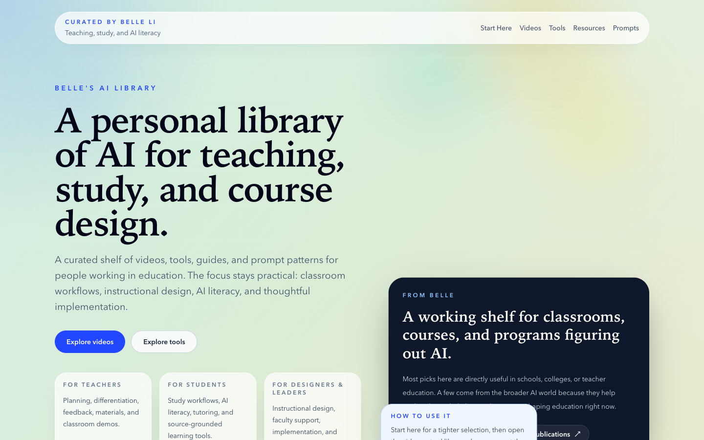
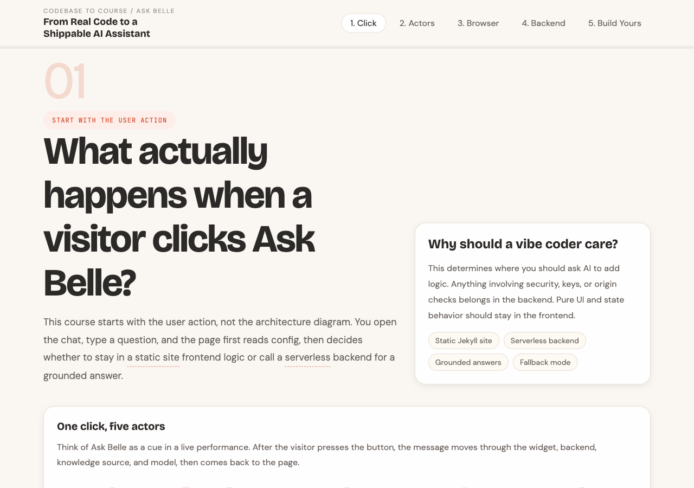
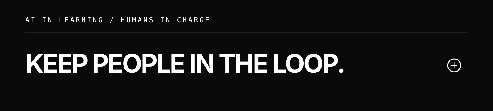

  <strong>English</strong> · <a href="./README.zh-CN.md">中文</a>

  

  

## About

<table>
  <tr>
    <td width="100%" valign="top">
      
<strong>AI in learning. Humans in charge.</strong>

      
I am a learning scientist and builder. I study what people choose to delegate to AI, what human judgment must retain, and how AI-supported learning can remain authentic, equitable, and agentic. Then I turn those questions into tools and learning environments people can actually use.

      
Ross-Lynn Postdoctoral Fellow · Purdue University

      

        <a href="https://www.beeelle.com/">Website</a> ·
        <a href="https://www.beeelle.com/research/">Research</a> ·
        <a href="https://www.beeelle.com/publications/">Publications</a> ·
        <a href="https://scholar.google.com/citations?user=82kWgvMAAAAJ&amp;hl=en">Google Scholar</a>
      

    </td>
  </tr>
</table>

## Selected work

<table>
  <tr>
    <td width="50%" valign="top">
      
       
      <strong>01 / AI for Education Resource Library</strong> 
      CURATION · TEACHING · OPEN WEB
      
A curated public library organized around teachers, learners, and learning designers—not another generic list of AI tools.

      <a href="https://ai-education-library.vercel.app/">Live site ↗</a> ·
      <a href="https://github.com/Beeeeeeelle/ai-education-library">GitHub ↗</a>
    </td>
    <td width="50%" valign="top">
      
       
      <strong>02 / Ask Belle</strong> 
      GROUNDED AI · COURSE · CODEX SKILL
      
A grounded website assistant, an open Codex skill, and a five-module course showing why bounded AI works.

      <a href="https://www.beeelle.com/ask-belle-course.html">Take the course ↗</a> ·
      <a href="https://github.com/Beeeeeeelle/ask-belle-site-chatbot">GitHub ↗</a>
    </td>
  </tr>
</table>

## Open source & experiments

- [**Easy Teach AI**](https://github.com/Beeeeeeelle/easy-teach-ai) — An evidence-aware open course for educators, extending from classroom practice to learning-product design and school AI governance.
- [**Vibe Board**](https://github.com/Beeeeeeelle/vibe-board) — A reflective pathway for planning and publishing a personal website through vibe coding.
- [**Database Normalization Tutor**](https://github.com/Umerfarooq1/database-normalization-tutor) — A CTAT tutor co-designed at CMU LearnLab Summer School: AI may explain, while the learning model retains grading authority.

## Research

My research program connects four strands: **learner agency and self-directed learning**, **authenticity and assessment**, **learner heterogeneity and equity**, and **AI literacy and design translation**.

- [PA-SDA Scale](https://doi.org/10.1016/j.system.2025.103793) — measuring personal attributes in AI-integrated self-directed learning.
- [AI-integrated SDL framework](https://doi.org/10.1109/TLT.2024.3386098) — foregrounding trust, support, and computational agency.
- [Collaborative problem solving with Intel Labs](https://doi.org/10.1016/j.caeai.2025.100393) — award-recognized research on conversational AI-mediated learning.

## Find me

[Website](https://www.beeelle.com/) ·
[Email](mailto:li4808@purdue.edu) ·
[Google Scholar](https://scholar.google.com/citations?user=82kWgvMAAAAJ&amp;hl=en) ·
[LinkedIn](https://www.linkedin.com/in/belle-li-198a72180/) ·
[CV](https://app.box.com/s/ao2hzfhxe97p9vgzv6lvahm6794xd0vx)

  

